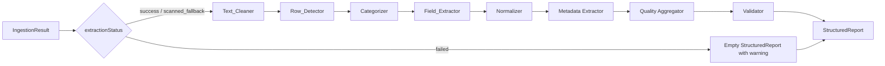

# Design Document — PDF Text Structuring (Phase 2)

## Overview

Phase 2 turns the raw text produced by Phase 1's `extractTextFromPdf` into a typed, validated `StructuredReport` that downstream phases (LLM summarization, PDF export) can consume without re-touching raw text. The pipeline is strictly structural: it parses, cleans, and types the report — it does not interpret values clinically, infer missing data, or generate any human-readable summary.

The design follows three principles:

1. **Determinism** — given the same input, the parser must always produce the same `StructuredReport`. Every sub-module is a pure function with no time, no I/O, and no random state.
2. **Honesty about uncertainty** — when a field cannot be reliably extracted, the parser records that fact (`uncertain: true`, `uncertaintyReason`, `extractionQuality.warnings`, `ambiguousLines`) instead of fabricating a value.
3. **Single source of truth for types** — `StructuredReport`, `LabEntry`, `ReportMetadata`, `ExtractionQuality`, and `ParseOptions` live in `src/lib/types/index.ts` and are not re-defined elsewhere.

### Scope

In scope:
- A synchronous `parseRawText(input: IngestionResult, options?: ParseOptions): StructuredReport` entry point in `src/lib/parser/`.
- Sub-modules: Text_Cleaner, Row_Detector, Field_Extractor, Normalizer, Categorizer.
- Zod schemas in `src/lib/validator/` covering `StructuredReport` and `LabEntry`.
- Unit tests per sub-module and integration tests against the three sample PDFs in `data/samples/`.

Out of scope (deferred to later phases):
- Clinical interpretation, status flags computed from numeric ranges (`normal` / `high` / `low`).
- LLM summarization or any text generation.
- PDF export.
- Persistence to disk (the controller layer in `src/server/` already handles writing JSON to `data/processed/`).

### Relationship to existing code

Phase 0 stubbed `parseReport`, `extractPatientInfo`, and `extractMarkers` in `src/lib/parser/index.ts` operating on a `BloodTestReport`. Phase 2 supersedes those stubs:

- The new entry point is `parseRawText`, returning the new `StructuredReport` type. The old `BloodTestReport` / `ParsedMarker` types remain in `src/lib/types/index.ts` for backwards compatibility but are not produced by this phase.
- `src/lib/parser/index.ts` becomes the orchestrator and barrel; the sub-modules live in sibling files (see Components and Interfaces).
- `src/lib/validator/index.ts` gains a new `validateStructuredReport` function. Existing `validateReport`, `validateMarker`, `validateMarkerValues`, `isParsedMarker` are left untouched for now.

---

## Architecture

### Pipeline

The parser is a linear pipeline of pure functions, orchestrated by `parseRawText`. Each stage transforms the data and the next stage cannot reach back upstream.



### Stage responsibilities

| Stage | Input | Output | Pure? |
|---|---|---|---|
| Text_Cleaner | `string` (raw text) | `string` (cleaned text, preserving line breaks) | yes |
| Row_Detector | `string` (cleaned text) | `DetectedRow[]` (each tagged `lab` or `ambiguous`) | yes |
| Categorizer | `DetectedRow[]` | `DetectedRow[]` with `category` field populated | yes |
| Field_Extractor | `DetectedRow` (one at a time) | `LabEntry` (with `uncertain` set when needed) | yes |
| Normalizer | `LabEntry` | `LabEntry` (whitespace trimmed, units canonicalised, range bounds parsed) | yes |
| Metadata Extractor | `string` (cleaned text head) | `ReportMetadata` | yes |
| Quality Aggregator | counts and `ambiguousLines` from earlier stages | `ExtractionQuality` | yes |
| Validator | `StructuredReport` | `{ valid, errors }` (Validator does **not** mutate the report) | yes |

### Why a pipeline of pure functions

- **Testability** — each stage can be unit-tested with inline string fixtures, and the orchestrator can be tested with a stub Field_Extractor if needed.
- **Determinism (Requirement 3.6, 6.6)** — purity is the simplest way to guarantee the "same input → same output" requirement. Property-based tests can encode this directly.
- **Failure isolation** — when a row fails to parse, only that row is marked `uncertain`; the rest of the report still flows through.

### Top-level orchestrator (`parseRawText`)

```ts
export function parseRawText(
  input: IngestionResult,
  options: ParseOptions = {},
): StructuredReport;
```

Algorithm:

1. **Short-circuit on failure** — if `input.extractionStatus === 'failed'`, return an empty `StructuredReport` with `extractionQuality.warnings = ['Extraction failed']` and `entries = []`. (Requirement 1.2)
2. **Wrap in try/catch** — any thrown error inside the pipeline is caught and converted to a `StructuredReport` with the error message in `extractionQuality.warnings` and `entries = []`. (Requirement 1.5, 1.6)
3. **Clean** — `cleaned = Text_Cleaner.clean(input.extractedText)`.
4. **Extract metadata** — `metadata = MetadataExtractor.extract(cleaned)` (operates on the head of the document).
5. **Detect rows** — `rows = Row_Detector.detect(cleaned)`. Multi-line continuation merging happens inside Row_Detector.
6. **Categorise** — `categorised = Categorizer.assignCategories(rows)` walks the row sequence, tracking the most recent section header.
7. **Extract fields** — for each row tagged `lab`, run `Field_Extractor.extract(row)` then `Normalizer.normalize(...)`.
8. **Aggregate quality** — count totals, build `ExtractionQuality` (set `lowConfidence` when `extractionStatus === 'scanned_fallback'`).
9. **Validate** — call `validateStructuredReport(report)`; on failure, set `extractionQuality.validationFailed = true` and log a structural warning (no patient data).
10. **Return** — strip `rawText` if `options.keepRawText !== true`. (Requirement 11.5)

### Module layout

```
src/lib/
  parser/
    index.ts            # exports parseRawText (barrel)
    orchestrator.ts     # parseRawText implementation
    text-cleaner.ts     # clean(rawText)
    row-detector.ts     # detect(cleanedText) and merge-continuation logic
    field-extractor.ts  # extract(row)
    normalizer.ts       # normalize(entry)
    metadata.ts         # extract(cleanedText)
    categorizer.ts      # assignCategories(rows)
    quality.ts          # buildQuality(counts, ambiguous, lowConfidence)
    patterns.ts         # shared regexes (units, ranges, flags, dates, age/gender)
    unit-map.ts         # canonical unit table
  validator/
    index.ts            # adds validateStructuredReport (kept as barrel)
    schema.ts           # Zod schemas for StructuredReport & LabEntry
  types/
    index.ts            # adds StructuredReport, LabEntry, ReportMetadata,
                        # ExtractionQuality, ParseOptions, DetectedRow
```

`src/lib/parser/index.ts` re-exports `parseRawText` (and the sub-module functions for testability) — no other module imports the sub-modules directly.

---

## Components and Interfaces

### Text_Cleaner — `src/lib/parser/text-cleaner.ts`

```ts
export function clean(rawText: string): string;
```

Responsibilities (Requirement 3):

- Splits the input into lines (preserving order), filters/transforms each line, then re-joins with `\n`.
- Removes repeated lab-name and address blocks: detects the lab block on the first occurrence (a contiguous run of 2-5 lines containing a known lab keyword and an address-like line), then strips identical runs that appear later.
- Removes lines matching `/^Page\s*:?\s*\d+\s+of\s+\d+$/i`.
- Removes full-line matches of doctor signature blocks, barcode label lines, and QR-code instruction lines, but **only** if the line contains no numeric value token and no unit token (Requirement 3.3 — protects rows that happen to contain footer-like words).
- Removes whitespace-only lines and separator-only lines (`-`, `_`, `=`, or combinations).
- Preserves section headers (all-uppercase or title-case lines without numeric or unit tokens) unchanged so the Categorizer can find them later.
- Pure: same input string → same output string. No I/O, no global state.

### Row_Detector — `src/lib/parser/row-detector.ts`

```ts
export interface DetectedRow {
  classification: 'lab' | 'ambiguous';
  rawText: string;       // post-merge text used as input to Field_Extractor
  lineIndex: number;     // index in the cleaned text (0-based)
  category?: string;     // populated by Categorizer
}

export function detect(cleanedText: string): DetectedRow[];
```

Responsibilities (Requirements 4, 7):

- Iterates lines and classifies each as `lab`, `ambiguous`, or non-data (skipped).
- A line is a candidate `lab` when it contains a numeric or recognised qualitative value token (`Negative`, `Positive`, `Reactive`, `Non-Reactive`, `Present`, `Absent`) **and** at least one of: a unit token, a reference-range pattern, or a flag token.
- Merges continuation lines into a single logical row when the rules in Requirement 7 are met:
  - A test-name-only line (no numeric, no unit) followed within 3 lines by a continuation line that contains a numeric or unit token, with no blank line, section header, or page-boundary marker between them, becomes one merged row separated by single spaces.
  - A reference-range continuation immediately after a value/unit line is folded into the same logical row.
  - If the merge stretch exceeds 3 lines, the merge stops and a `"Multi-line merge exceeded 3 lines at row N"` warning is queued for `extractionQuality.warnings`.
- Skips lines matching known non-data patterns: section headers (Requirement 3.5), `Method:` / `Methodology:` / `Note:` prefixes, prose-only lines, and disclaimer keywords (`"not a substitute"`, `"consult your physician"`).
- Anything that is neither a clear `lab` nor a clear non-data pattern is emitted with `classification: 'ambiguous'`.
- Returns rows in source order (Requirement 4.4).
- For empty / whitespace-only cleaned text, returns `[]` (Requirement 4.6).

### Categorizer — `src/lib/parser/categorizer.ts`

```ts
export function assignCategories(rows: DetectedRow[]): DetectedRow[];
```

- Walks `rows` in order, tracking the most recent section header line as `currentCategory`.
- Section header detection re-uses the predicate from Text_Cleaner (all-uppercase or title-case, no numeric, no unit).
- Each row receives `category = currentCategory ?? 'Uncategorized'` (Requirement 8.2).
- Section header text is stored verbatim — no whitespace/case normalization (Requirement 8.3).
- Whitespace-only or blank section header lines do not update `currentCategory` (Requirement 8.4).

### Field_Extractor — `src/lib/parser/field-extractor.ts`

```ts
export function extract(row: DetectedRow): LabEntry;
```

Responsibilities (Requirement 5):

- Splits the row text using a pattern in `patterns.ts`. The general row shape used by Thyrocare-like reports is:
  ```
  <test name> <value> [<unit>] [<flag>] [<reference range>] [<notes>]
  ```
- Extracts:
  - `testName` — the leading non-numeric run.
  - `value` — first number, decimal, or qualitative token after the name.
  - `unit` — token immediately after `value` matching the unit pattern (e.g., `mg/dL`, `g/dL`, `IU/L`, `pg/ml`, `%`, `mmol/L`).
  - `flag` — recognised tokens `H | L | * | HIGH | LOW | CRITICAL | ABNORMAL`. Anything in the flag position that is not recognised is moved to `notes`.
  - `referenceRange` — patterns like `12.0-16.0`, `< 30`, `Negative`, `197-771 pg/ml`. Stored as a structured object with optional `low`, `high`, `text`.
  - `notes` — any trailing tokens after all known fields are consumed.
- If `testName` or `value` cannot be extracted, sets `uncertain = true` and `uncertaintyReason = "Missing <field>; raw: '<row text>'"` (Requirement 5.7) and **continues** processing remaining fields.
- If a field is present in the row but cannot be parsed into its expected type (e.g., a unit that has digits embedded in a way the pattern can't split), leaves that field `undefined` and appends a parse-failure note to `uncertaintyReason` (Requirement 5.8).
- The function is pure — no I/O, no shared state.

### Normalizer — `src/lib/parser/normalizer.ts`

```ts
export function normalize(entry: LabEntry): LabEntry;
```

Responsibilities (Requirement 6):

- Trims leading/trailing whitespace on every string field (`testName`, `value`, `unit`, `referenceRange.text`, `flag`, `notes`, `uncertaintyReason`).
- Collapses runs of two or more whitespace characters in `testName` to a single space.
- Looks `unit` up in `unit-map.ts` (e.g., `MG/DL → mg/dL`, `G/DL → g/dL`, `IU/L → IU/L`, `PG/ML → pg/mL`). Units not present in the map are kept after trimming, no case conversion.
- Parses numeric reference-range bounds when the range text matches `^\s*(\d+(?:\.\d+)?)\s*[-–]\s*(\d+(?:\.\d+)?)\s*$`. Otherwise stores the original text in `referenceRange.text` and leaves `low`/`high` undefined.
- Pure: same `LabEntry` → same normalised `LabEntry`.

### Metadata Extractor — `src/lib/parser/metadata.ts`

```ts
export function extract(cleanedText: string): ReportMetadata;
```

- Operates on the first ~30 lines of cleaned text (the header zone). It does **not** consume the body — the body is processed by Row_Detector independently, both starting from the same cleaned text.
- Field-by-field heuristics:
  - `patientName` — looks for a line matching `Name\s*:\s*(.+)` or a stand-alone capitalised name line near the top.
  - `patientAge` and `patientGender` — when the name line ends with `(<digits>Y/<single-letter>)` (e.g., `(22Y/M)`), parses the digits to a `number` and maps the letter to one of `M | F | O`. If the format does not match, leaves both `undefined` (Requirement 2.7, 2.8).
  - `reportDate`, `sampleDate` — looks for `Report Date`, `Reported on`, `Sample Collected`, `Collection Date` labels. Tries to convert to ISO `YYYY-MM-DD` using a fixed list of accepted patterns (`DD/MM/YYYY`, `DD-MM-YYYY`, `DD MMM YYYY`, `MMM DD, YYYY`); if conversion fails, stores the verbatim source string (Requirement 2.2, 2.3).
  - `labName` — first line containing a known lab keyword (e.g., `Thyrocare`, `Lab`, `Diagnostics`).
  - `reportId` — barcode/ID patterns like `Barcode\s*:\s*([A-Z0-9-]+)` or `Report\s*ID\s*:\s*([A-Z0-9-]+)`.
- Anything not found is left `undefined` (Requirement 2.6) — never fabricated.

### Quality Aggregator — `src/lib/parser/quality.ts`

```ts
export interface QualityCounts {
  totalRowsDetected: number;
  successfullyParsed: number;
  uncertainRows: number;
  skippedRows: number;
}

export function build(
  counts: QualityCounts,
  ambiguousLines: string[],
  warnings: string[],
  lowConfidence: boolean,
  validationFailed: boolean,
): ExtractionQuality;
```

- Computes `confidence = totalRowsDetected === 0 ? 0 : successfullyParsed / totalRowsDetected` (Requirement 9.4).
- Asserts the structural invariant `successfullyParsed + uncertainRows ≤ totalRowsDetected` (Requirement 9.2). On violation, raises an internal `Error` that the orchestrator catches via the same try/catch wrapper as Requirement 1.5; the violation is recorded as a warning.
- Strips any patient-identifiable content from `warnings` and `ambiguousLines` before returning. The contract is that callers only ever push structural strings into these fields (Requirement 9.6); the aggregator enforces this with a defensive scrub that removes anything matching the patient-name or value patterns from `metadata`.
- Sets `lowConfidence` to the value passed in (true when `extractionStatus === 'scanned_fallback'`).

### Validator — `src/lib/validator/schema.ts` + `src/lib/validator/index.ts`

```ts
export function validateStructuredReport(
  value: unknown,
): { valid: boolean; errors: { field: string; message: string }[] };
```

- Defines two Zod schemas:
  - `LabEntrySchema` — `testName: z.string().min(1)`, `value: z.string()`, `unit: z.string().optional()`, `referenceRange: ReferenceRangeSchema.optional()`, `flag: z.string().optional()`, `notes: z.string().optional()`, `category: z.string()`, `uncertain: z.boolean()`, `uncertaintyReason: z.string().optional()`.
  - `StructuredReportSchema` — `metadata: ReportMetadataSchema`, `entries: z.array(LabEntrySchema)`, `rawText: z.string().optional()`, `extractionQuality: ExtractionQualitySchema`.
- On failure, converts Zod's `ZodError` into the documented `{ field, message }[]` shape using dot-notation paths (e.g., `entries.3.testName`).
- The orchestrator calls `validateStructuredReport` after building the report; the report is **always returned** regardless of validation outcome (Requirement 10.5). Failures only set `extractionQuality.validationFailed = true` and emit a structural log entry (no patient data).

---

## Data Models

All types are added to `src/lib/types/index.ts` and exported from there only.

```ts
// ─── Phase 2 Types ────────────────────────────────────────────────────────────

export interface ParseOptions {
  /** When true, the returned StructuredReport will include the cleaned `rawText`. */
  keepRawText?: boolean;
}

export interface ReportMetadata {
  patientName?: string;
  patientAge?: number;
  patientGender?: 'M' | 'F' | 'O';
  reportDate?: string;     // ISO YYYY-MM-DD when convertible; verbatim string otherwise
  sampleDate?: string;     // same conversion rule as reportDate
  labName?: string;
  reportId?: string;
}

export interface LabReferenceRange {
  low?: number;
  high?: number;
  text?: string;
}

export interface LabEntry {
  testName: string;
  value: string;                       // string form preserves qualitative values
  unit?: string;
  referenceRange?: LabReferenceRange;
  flag?: string;
  notes?: string;
  category: string;                    // 'Uncategorized' when no header seen
  uncertain: boolean;
  uncertaintyReason?: string;
}

export interface ExtractionQuality {
  totalRowsDetected: number;
  successfullyParsed: number;
  uncertainRows: number;
  skippedRows: number;
  ambiguousLines: string[];
  warnings: string[];
  confidence: number;                  // [0, 1]
  lowConfidence: boolean;
  validationFailed?: boolean;
}

export interface StructuredReport {
  metadata: ReportMetadata;
  entries: LabEntry[];
  rawText?: string;                    // present iff ParseOptions.keepRawText === true
  extractionQuality: ExtractionQuality;
}

// Internal type (exported for testing only)
export interface DetectedRow {
  classification: 'lab' | 'ambiguous';
  rawText: string;
  lineIndex: number;
  category?: string;
}
```

### Field-level invariants

| Invariant | Source | Stage that enforces it |
|---|---|---|
| `confidence === successfullyParsed / totalRowsDetected` (or `0` when total is `0`) | Req 9.4 | Quality Aggregator |
| `successfullyParsed + uncertainRows ≤ totalRowsDetected` | Req 9.2 | Quality Aggregator |
| `entries.every(e => e.uncertain || (e.value !== '' && e.value !== undefined))` | Req 12.4 | Field_Extractor sets `uncertain` when value is missing |
| `entries[i].category` is either a header from the cleaned text or `'Uncategorized'` | Req 8 | Categorizer |
| `metadata.patientGender` ∈ `{ 'M', 'F', 'O', undefined }` | Req 2.7, 2.8 | Metadata Extractor |
| `entries.length === 0` when `extractionStatus === 'failed'` | Req 1.2 | Orchestrator short-circuit |
| `'rawText' in report === Boolean(options.keepRawText)` | Req 11.5 | Orchestrator |
| `extractionQuality.warnings` and `ambiguousLines` contain no patient data | Req 9.6 | Quality Aggregator (defensive scrub) |

---

## Correctness Properties

*A property is a characteristic or behaviour that should hold true across all valid executions of the system — a formal statement about what the software is supposed to do. Properties bridge the gap between human-readable acceptance criteria and machine-verifiable correctness guarantees, and are designed to be encoded as property-based tests that exercise the parser across many randomly generated inputs.*

The following properties are derived from the prework analysis of the acceptance criteria in `requirements.md`. Pure smoke checks (type signatures, schema existence) and integration assertions against the real sample PDFs are deferred to the Testing Strategy section.

### Property 1: Totality on recognised inputs

*For any* `IngestionResult` whose `extractionStatus` is one of `'success'`, `'scanned_fallback'`, or `'failed'` and whose `extractedText` and `originalFilename` are strings, `parseRawText(input)` SHALL return a `StructuredReport` without throwing an exception.

**Validates: Requirements 1.1, 1.5, 1.6**

### Property 2: Failure short-circuit

*For any* `IngestionResult` with `extractionStatus === 'failed'`, the returned `StructuredReport` SHALL have `entries.length === 0` and `extractionQuality.warnings` SHALL contain the string `"Extraction failed"`.

**Validates: Requirements 1.2**

### Property 3: lowConfidence reflects extractionStatus

*For any* `IngestionResult`, `extractionQuality.lowConfidence === (input.extractionStatus === 'scanned_fallback')`.

**Validates: Requirements 1.3, 1.4, 9.7**

### Property 4: Patient name extraction

*For any* synthetic header text containing a `Name : <name>` line where `<name>` is a non-empty string of printable characters, `metadata.patientName` SHALL equal `<name>` after trimming.

**Validates: Requirements 2.1**

### Property 5: Date extraction is ISO-when-convertible, verbatim-otherwise

*For any* date string `d` placed after a `Report Date` or `Sample Collected` label in the header, `metadata.reportDate` (resp. `metadata.sampleDate`) SHALL equal the ISO `YYYY-MM-DD` form of `d` when `d` matches one of the accepted patterns (`DD/MM/YYYY`, `DD-MM-YYYY`, `DD MMM YYYY`, `MMM DD, YYYY`), and SHALL equal the verbatim source string otherwise.

**Validates: Requirements 2.2, 2.3**

### Property 6: Age and gender annotation parsing

*For any* patient name line, when the line ends with an annotation matching `(<digits>Y/<single-letter>)`, `metadata.patientAge` SHALL be the numeric value of `<digits>` and `metadata.patientGender` SHALL be the corresponding letter mapped to one of `'M'`, `'F'`, `'O'`. When the annotation does not match this exact format, both fields SHALL be `undefined`.

**Validates: Requirements 2.7, 2.8**

### Property 7: Missing metadata fields are not fabricated

*For any* header text that does not contain markers for a given metadata field (`patientName`, `reportDate`, `sampleDate`, `labName`, `reportId`), the corresponding field on `metadata` SHALL be `undefined`.

**Validates: Requirements 2.6**

### Property 8: Cleaner removes noise without removing data lines

*For any* cleaned-text input, the output of `Text_Cleaner.clean` SHALL contain (a) no lines matching `/^Page\s*:?\s*\d+\s+of\s+\d+$/i`, (b) no whitespace-only lines, (c) no separator-only lines (composed entirely of `-`, `_`, `=`, or whitespace), and (d) at most one occurrence of any contiguous repeated lab/address block; AND any line containing a numeric value token or a unit token SHALL be preserved in the output even when it partially matches a footer pattern.

**Validates: Requirements 3.1, 3.2, 3.3, 3.4**

### Property 9: Section headers are preserved verbatim by the cleaner

*For any* line that is all-uppercase or title-case and contains neither a numeric value token nor a unit token, the line SHALL appear in `Text_Cleaner.clean(input)` exactly as in `input` (no whitespace trimming, no case conversion).

**Validates: Requirements 3.5**

### Property 10: Text_Cleaner is deterministic and pure

*For any* input string `s`, `clean(s) === clean(s)` (referential transparency) and `clean` SHALL not perform any I/O, time-dependent, or random operation.

**Validates: Requirements 3.6**

### Property 11: Lab-row classification rule

*For any* line `L` that contains both (a) a numeric token or one of the qualitative tokens `Negative | Positive | Reactive | Non-Reactive | Present | Absent`, and (b) at least one of a unit token, a reference-range pattern, or a flag token, `Row_Detector.detect` SHALL emit a row whose `classification === 'lab'` and whose `rawText` (after merge) contains `L`.

**Validates: Requirements 4.1**

### Property 12: Non-data line skipping

*For any* line whose entire content matches one of (a) a section header (per the predicate in Property 9), (b) a `Method:` / `Methodology:` / `Note:` prefix line, (c) a prose-only line with no numeric or unit tokens, or (d) a disclaimer line containing keywords `not a substitute` or `consult your physician`, that line SHALL NOT appear as a `'lab'` row in the detector output.

**Validates: Requirements 4.3**

### Property 13: Detected rows preserve source order

*For any* cleaned-text input, the `lineIndex` values of the rows returned by `Row_Detector.detect` SHALL be strictly monotonically increasing.

**Validates: Requirements 4.4**

### Property 14: Ambiguous classification

*For any* line that is neither a clear lab row (per Property 11) nor a clear non-data pattern (per Property 12), `Row_Detector.detect` SHALL emit a row with `classification === 'ambiguous'` whose `rawText` equals the source line.

**Validates: Requirements 4.5**

### Property 15: Empty input yields empty row list

*For any* string composed entirely of whitespace characters (including the empty string), `Row_Detector.detect(s)` SHALL return `[]` with no ambiguous entries.

**Validates: Requirements 4.6**

### Property 16: Multi-line merging within 3-line window

*For any* sequence of lines where a test-name-only line `T` is followed within 3 lines by a line `C` containing a numeric or unit token, with no blank line, section header, or page-boundary marker between them, `Row_Detector.detect` SHALL emit a single row whose `rawText` equals `T + ' ' + C` (and similarly for reference-range continuations); when the same pattern occurs but is separated by a blank/header/page-break line, no merge SHALL occur and the test-name-only line SHALL not appear as a `'lab'` row.

**Validates: Requirements 7.1, 7.2, 7.3, 7.4**

### Property 17: Field extraction completeness on well-formed rows

*For any* synthetic lab-row string of the form `<name> <value> [<unit>] [<flag>] [<range>] [<notes>]` generated from the row grammar, `Field_Extractor.extract` SHALL set every present field on the resulting `LabEntry` to its source token, set every absent optional field to `undefined`, and SHALL set `uncertain` to `false`.

**Validates: Requirements 5.1, 5.2, 5.3, 5.4, 5.6**

### Property 18: Flag recognition routes unrecognised tokens to notes

*For any* lab-row string in which the flag-position token is not one of `H | L | * | HIGH | LOW | CRITICAL | ABNORMAL`, `LabEntry.flag` SHALL be `undefined` and the unrecognised token SHALL appear as a substring of `LabEntry.notes`.

**Validates: Requirements 5.5**

### Property 19: Missing required fields imply uncertainty with traceable reason

*For any* row from which `testName` or `value` cannot be extracted, the resulting `LabEntry` SHALL have `uncertain === true` and `uncertaintyReason` SHALL be a non-empty string that contains the original row text. *For any* row in which an optional field is present but unparseable, that field SHALL be `undefined` and `uncertaintyReason` SHALL be a non-empty string identifying the field. Conversely, *for any* `LabEntry` produced by the parser, either `uncertain === true` or `value` is a non-empty string (so empty/null/undefined values never coexist with `uncertain === false`).

**Validates: Requirements 5.7, 5.8, 12.4**

### Property 20: Normalizer produces well-formed strings

*For any* `LabEntry` `e`, `normalize(e)` SHALL satisfy: (a) every defined string field has no leading or trailing whitespace, and (b) `testName` contains no run of two or more consecutive whitespace characters.

**Validates: Requirements 6.1, 6.2**

### Property 21: Unit canonicalisation

*For any* `LabEntry` `e` whose `unit` (after trimming) is a key in the canonical unit map, `normalize(e).unit` SHALL equal the canonical value from the map. *For any* `e` whose trimmed `unit` is not a key in the map, `normalize(e).unit` SHALL equal the trimmed source string with no case conversion applied.

**Validates: Requirements 6.3**

### Property 22: Reference range parsing

*For any* `LabEntry` `e` whose `referenceRange.text` matches `^\s*(\d+(?:\.\d+)?)\s*[-–]\s*(\d+(?:\.\d+)?)\s*$` with parsable bounds `lo` and `hi`, `normalize(e).referenceRange` SHALL satisfy `low === lo` and `high === hi`. *For any* `e` whose range text contains a non-numeric suffix or comparison operator (e.g., `< 30`, `Negative`, `197-771 pg/ml`), `normalize(e).referenceRange.low` and `.high` SHALL be `undefined` and `.text` SHALL equal the original range string.

**Validates: Requirements 6.4, 6.5**

### Property 23: Normalizer is idempotent and pure

*For any* `LabEntry` `e`, `normalize(normalize(e))` SHALL be deeply equal to `normalize(e)`, and `normalize` SHALL not perform any I/O.

**Validates: Requirements 6.6**

### Property 24: Category assignment from most recent header

*For any* sequence of cleaned-text lines containing an interleaving of section headers and lab rows, every emitted `LabEntry.category` SHALL equal the verbatim text of the most recent section header preceding the row in source order, or `'Uncategorized'` when no header has yet been encountered. Whitespace-only or blank lines SHALL not update the active category.

**Validates: Requirements 8.1, 8.2, 8.3, 8.4**

### Property 25: Quality count invariant

*For any* `StructuredReport` produced by `parseRawText`, `extractionQuality` SHALL satisfy `successfullyParsed + uncertainRows ≤ totalRowsDetected`, all four counts SHALL be non-negative integers, and `confidence` SHALL equal `totalRowsDetected === 0 ? 0 : successfullyParsed / totalRowsDetected`, lying in the closed interval `[0, 1]`.

**Validates: Requirements 9.2, 9.4**

### Property 26: No patient data leaks into quality strings

*For any* `IngestionResult` whose extracted text contains a synthetic patient-name token `T` and synthetic measured-value tokens `V1, V2, ...`, none of `T`, `V1`, `V2, ...` SHALL appear as a substring of any element of `extractionQuality.warnings` or `extractionQuality.ambiguousLines`.

**Validates: Requirements 9.6**

### Property 27: Validator round-trip on parser output

*For any* `IngestionResult`, `validateStructuredReport(parseRawText(input))` SHALL return `{ valid: true, errors: [] }` (the parser's own output always satisfies its schema), and *for any* object that violates the schema, `validateStructuredReport` SHALL return `{ valid: false, errors: e[] }` where every `e` is shaped as `{ field: string, message: string }` with `field` in dot-notation. The fully-populated report SHALL always be returned by `parseRawText`, and `extractionQuality.validationFailed === true` SHALL be set in any path where the internal validator rejects the report.

**Validates: Requirements 10.3, 10.4, 10.5**

### Property 28: rawText key presence reflects ParseOptions

*For any* `IngestionResult` and any `options`, `('rawText' in parseRawText(input, options)) === Boolean(options?.keepRawText)`. When `keepRawText !== true`, the `rawText` key SHALL be absent from the returned object (not present as `undefined`).

**Validates: Requirements 11.5**

---

## Error Handling

The parser must never propagate exceptions to its caller for any `IngestionResult` whose `extractionStatus` is one of the three recognised values (Requirement 1.6). Errors are categorised, contained at the boundary they occur, and surfaced through the structured `extractionQuality` channel rather than thrown.

### Error categories

| Category | Trigger | Handling | User-visible effect |
|---|---|---|---|
| **Upstream extraction failure** | `input.extractionStatus === 'failed'` | Orchestrator short-circuits before invoking any sub-module. | `entries === []`, `warnings` contains `"Extraction failed"`, `confidence === 0`, `lowConfidence === false`. |
| **Scanned-fallback low confidence** | `input.extractionStatus === 'scanned_fallback'` | Pipeline runs normally; `lowConfidence` is set to `true`. | Caller can decide to display a quality banner. Parsing still attempts to populate entries. |
| **Row-level extraction failure** | `Field_Extractor` cannot extract `testName` or `value` from a row. | Entry is emitted with `uncertain: true` and a structural `uncertaintyReason`. The pipeline continues with the remaining rows. | Row appears in `entries` but is flagged. `uncertainRows` increments. |
| **Field-level parse failure** | A field is present in the source row but unparseable (e.g., malformed unit). | Field is left `undefined`; `uncertaintyReason` records the failure. | Other fields on the entry remain valid. |
| **Multi-line merge cap exceeded** | Continuation merging would exceed 3 lines. | Merging stops at the cap; a structural warning `"Multi-line merge exceeded 3 lines at row N"` is queued. | Warning surfaces in `extractionQuality.warnings`; affected row may be `ambiguous`. |
| **Quality invariant violation** | Internal counts violate `successfullyParsed + uncertainRows ≤ totalRowsDetected`. | Quality Aggregator throws an internal `Error`; orchestrator's outer try/catch catches it. | Caught as the next category. |
| **Unexpected internal exception** | Any thrown error inside `Text_Cleaner`, `Row_Detector`, `Field_Extractor`, `Normalizer`, `Categorizer`, `MetadataExtractor`, or `QualityAggregator`. | Outer try/catch in `parseRawText` converts it to `{ entries: [], extractionQuality.warnings: [<error.message>], ... }`. | Parser returns a well-formed `StructuredReport`; no exception leaves the function. |
| **Validator rejection** | `validateStructuredReport` returns `{ valid: false, ... }` for the parser's own output. | Set `extractionQuality.validationFailed = true`; emit a structural log entry; return the report unchanged. | Downstream phases can decide whether to consume the report or treat it as a hard failure. |

### Error containment guarantees

- **Boundary**: every sub-module's public function returns its declared result type or throws a single well-typed `Error`. Sub-modules do not catch each other's errors — only the top-level orchestrator's outer try/catch does.
- **No partial state escape**: when the outer try/catch fires, the orchestrator returns a fresh `StructuredReport` (`entries: []`, populated `extractionQuality`). Any partial work-in-progress is discarded so downstream phases never see a half-built object.
- **No PII in error strings**: error messages, warnings, and ambiguous-line entries contain only structural information. The Quality Aggregator performs a final defensive scrub against patterns extracted from `metadata` (Property 26) before surfacing these arrays.
- **Logging**: validator failures emit a single warning-level log entry tagged `parser:validation-failed` with structural counts only. No raw row text and no metadata values are logged.

### Determinism under errors

The error path itself must be deterministic. For a given input, whether a row triggers the row-level uncertainty path or the field-level fallback path SHALL be entirely a function of the input string. This is asserted by the determinism property of `parseRawText` (the natural extension of Properties 10 and 23 to the orchestrator) and is exercised in property tests by running the parser twice on each generated input and asserting deep equality of the output.

### What is *not* an error

- A perfectly clean PDF whose body contains zero detectable lab rows is a valid output (`entries === []`, no warnings, `confidence === 0`). This must not be confused with the failure short-circuit, which surfaces the `"Extraction failed"` warning.
- An ambiguous line is not an error — it is structured data emitted on the `ambiguousLines` channel for later inspection.

---

## Testing Strategy

### PBT applicability assessment

Property-based testing **is** appropriate for this feature. The parser is a pipeline of pure functions over strings and structured data, with universal properties (round-trips, idempotence, structural invariants, "for all inputs"-shaped acceptance criteria) that are far better validated by random input generation than by hand-written examples. The prework analysis classified the majority of acceptance criteria as `PROPERTY`. Smoke and integration items are tested separately under their own strategies.

### Dual testing approach

| Test type | What it validates | Where it lives |
|---|---|---|
| **Unit tests (example-based)** | Specific input/output examples, edge cases, error conditions, and integration points between sub-modules. At least 2 per sub-module, per Requirement 12.5. | `tests/unit/parser/<sub-module>.test.ts`, `tests/unit/validator/schema.test.ts`. |
| **Property-based tests** | The 28 universal properties listed above. Each property maps to exactly one PBT, configured for ≥100 iterations. | `tests/property/parser/*.property.test.ts`. |
| **Integration tests against sample PDFs** | The end-to-end `extractTextFromPdf → parseRawText` pipeline against the three real fixtures in `data/samples/` (Requirements 12.1, 12.2, 12.3). | `tests/integration/pipeline.test.ts`. |
| **Smoke tests** | Type signatures, schema existence, and module barrels (Requirements 10.1, 10.2, 11.1, 11.2, 11.3, 11.4). | `tests/smoke/types.test.ts`. |

### Property-based testing configuration

- **Library**: [`fast-check`](https://github.com/dubzzz/fast-check) — the de-facto PBT library for the TypeScript / Node ecosystem. PBT MUST NOT be hand-rolled.
- **Iterations**: every property test runs with `numRuns: 100` minimum (`fc.assert(... , { numRuns: 100 })`).
- **Determinism**: each property test fixes a `seed` in CI logs so failing examples can be reproduced. `fast-check`'s built-in shrinker is relied on for minimal counter-examples.
- **Tagging**: every property test file annotates each test with a comment of the form:
  ```ts
  // Feature: pdf-text-structuring, Property 16: Multi-line merging within 3-line window
  ```
- **One property → one test**: each of the 28 properties above is implemented as a single `it(...)` block. Combining properties is not allowed (it muddles failure attribution).

### Generators

A small generator library lives in `tests/property/generators.ts` and provides:

- `arbIngestionResult` — arbitrary `IngestionResult`, with status biased to the three recognised values, `extractedText` drawn from a domain-aware string generator.
- `arbCleanedText` — text composed of a random sequence of section headers, lab rows (from `arbLabRowString`), continuation lines, blank lines, and noise lines. Used for Row_Detector and Categorizer properties.
- `arbLabRowString` — a row grammar producing strings of the form `<name> <value> [<unit>] [<flag>] [<range>] [<notes>]` with controllable presence/absence of each optional segment.
- `arbLabEntry` — arbitrary `LabEntry` instances, used for Normalizer properties.
- `arbDateString` — produces dates in the four accepted formats and adversarial free-form strings (Property 5).
- `arbHeaderText` — produces synthetic report headers for Metadata Extractor properties (Properties 4-7), with controllable presence of `Name : ...`, age/gender annotations, dates, lab keywords, and barcode patterns.
- `arbPiiInjection` — wraps a base text with a synthetic patient-name token and synthetic measured values, returning the augmented text plus the set of forbidden tokens. Used for Property 26.

All generators are seedable through `fast-check`'s default mechanism so failures are reproducible.

### Coverage matrix

| Property | Test file | Sub-module exercised |
|---|---|---|
| 1, 2, 3 | `orchestrator.property.test.ts` | Orchestrator |
| 4, 5, 6, 7 | `metadata.property.test.ts` | Metadata Extractor |
| 8, 9, 10 | `text-cleaner.property.test.ts` | Text_Cleaner |
| 11–16 | `row-detector.property.test.ts` | Row_Detector |
| 17, 18, 19 | `field-extractor.property.test.ts` | Field_Extractor |
| 20, 21, 22, 23 | `normalizer.property.test.ts` | Normalizer |
| 24 | `categorizer.property.test.ts` | Categorizer |
| 25, 26 | `quality.property.test.ts` | Quality Aggregator |
| 27, 28 | `orchestrator.property.test.ts` | Orchestrator + Validator |

### Integration tests against sample PDFs

Three integration tests, one per fixture, run the full Phase 1 → Phase 2 pipeline:

| PDF | Expected `extractionStatus` | Confidence threshold | Required `testName` substring |
|---|---|---|---|
| `shivek_June25.pdf` | `success` | `> 0.5` | `HEMOGLOBIN` |
| `shivek_March26.pdf` | `success` | `> 0.5` | `HEMOGLOBIN` |
| `shivek_urm_March26.pdf` | depends on text-layer presence; if `scanned_fallback`, threshold `> 0.3`; otherwise `> 0.5` | per row above | `25-OH VITAMIN D (TOTAL)` |

Each integration test additionally asserts: `entries.length > 0`, `entries.every(e => e.uncertain || (e.value !== '' && e.value != null))`, and the validator passes (`validateStructuredReport(report).valid === true`).

### Smoke tests

A single smoke test file asserts:

- `parseRawText` is exported with the correct synchronous signature from `src/lib/parser/index.ts`.
- `StructuredReport`, `LabEntry`, `ReportMetadata`, `ExtractionQuality`, and `ParseOptions` are exported from `src/lib/types/index.ts` and from no other module.
- `LabEntrySchema` and `StructuredReportSchema` exist and accept a known-valid example.

### Unit-test floor

Per Requirement 12.5, each of `Text_Cleaner`, `Row_Detector`, `Field_Extractor`, and `Normalizer` has at least two unit tests using inline fixture strings derived from the sample PDFs:

- one happy-path test (a representative valid input),
- one noise / edge-case test (e.g., footer-with-data-token preservation, malformed unit, dual-pattern line, empty input).

Unit tests are intentionally kept thin — the heavy lifting of "correctness across the input space" is the property tests' job; unit tests document concrete examples and act as fast regression tripwires.

### Running the tests

The repository uses Vitest. The standard commands are:

```bash
# all tests, single run (no watch)
npx vitest run

# only property tests
npx vitest run tests/property

# only integration tests (requires sample PDFs in data/samples/)
npx vitest run tests/integration

# reproduce a specific property failure with a seed
npx vitest run tests/property/parser/row-detector.property.test.ts -t "Property 16"
```

Property tests are configured to fail the build if any property's `numRuns` falls below 100 or if any test omits the property tag comment.
